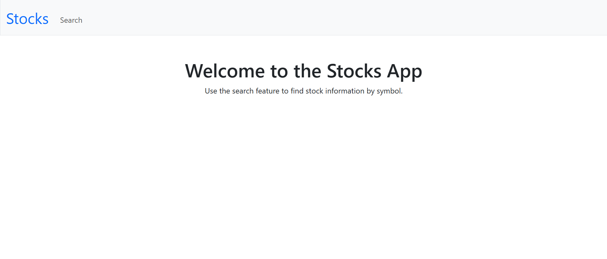
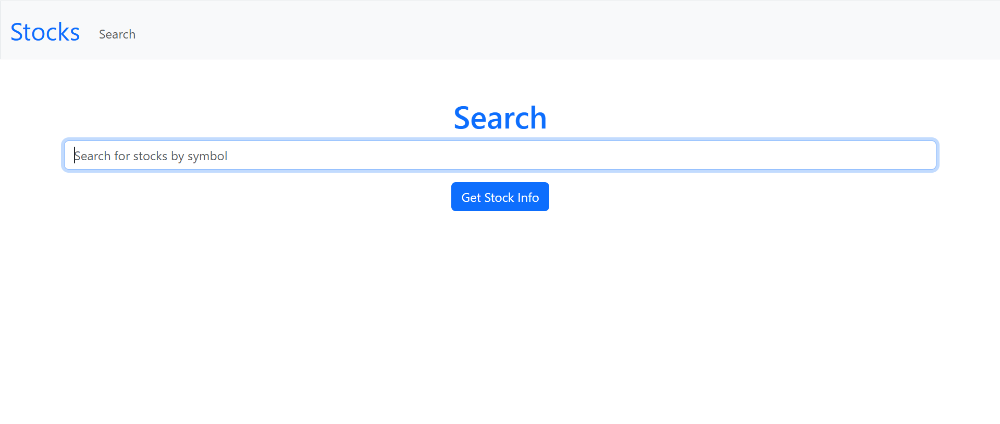
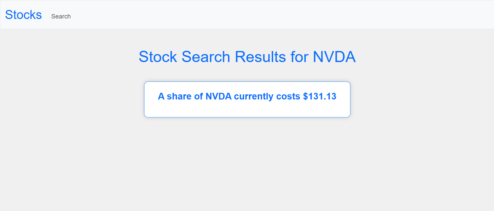

# Stocks
----
A simple web application for finding the stock price of a company. Using api-ninjas' Stock Price API.

## How to Use the App
You'll need to get an API Ninjas API key to use. Get one for free at [API Ninjas](https://api-ninjas.com/).
Fork the project, and in 
```python
app.py
```
replace `api_key` with your API key. Then, in your terminal, run the following commands:
```bash
pip install -r requirements.txt
cd stocks
flask run
```
Open your web browser and navigate to `http://localhost:5000` to start using the app.
### Example Screenshots

*Search for a stock symbol.*


*View stock details.*


*Results displayed for the searched stock.*
